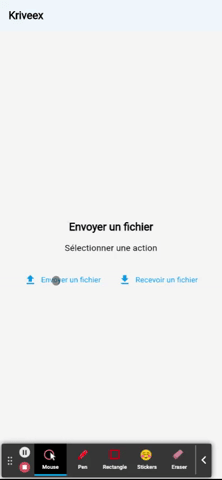
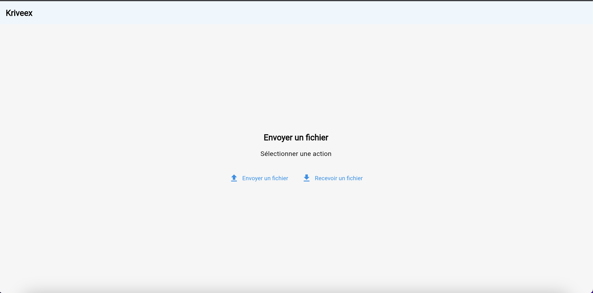

# Kriveex

Send files using QR Code

## Getting Started

> ⚠️ The source code is dirty and written with haste. There are still a lot of improvements to do (even if it remains a project that is not intended for any use)

&nbsp;&nbsp;&nbsp;&nbsp;

&nbsp;&nbsp;&nbsp;&nbsp;

&nbsp;&nbsp;&nbsp;&nbsp;

# TODO
- Write documentation
- Optimise file transfer